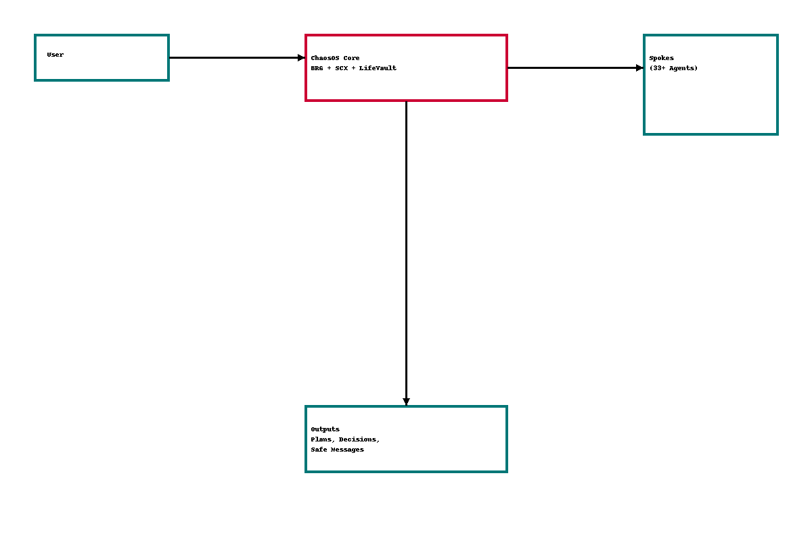

# Jennifer Barron — Data + AI Ops Portfolio  
Building structured systems for high-complexity, real-world environments using SQL, analytics, and AI-assisted workflow design.

This portfolio documents my transition from 15+ years in CX & Operations into Data + AI-powered Operations, with a focus on practical, applied systems thinking.

---

## 🧩 ChaosOS™ AI Workflow Architecture
*A real, working multi-agent GPT operating system.*

ChaosOS is a role-based, multi-agent framework I designed inside GPT to model, manage, and reason through complex, multi-step workflows across diverse domains.
It powers decisions for:

* medical coordination & escalation

* legal & compliance reasoning

* government case management

* financial and risk workflows

* travel safety & logistics

* education planning & learning systems

* job search targeting

* multi-step planning & cross-domain analysis

ChaosOS is both:

1. A real AI-assisted system I use to organize and reason through complex, interdependent tasks, and

2. A portfolio artifact demonstrating how I design Data + AI workflows, agent roles, guardrails, and decision flows.

---

## 👋 About Me

I bring **15+ years in Customer Experience & Operations** — leading remote teams, running high-volume workflows, managing escalations, and rebuilding broken processes.

**My core strengths include:**

* structured analytical reasoning

* workflow modeling & ops design

* data interpretation & problem framing

* AI-assisted decision architecture

cross-domain system thinking

I’m now expanding my skillset into SQL, BI, and data-driven operations, and documenting that progression through projects like ChaosOS, KidOS, and SQL practice workflows.

---

## 🎯 Current Focus

- Data + AI-powered **operations design**  
- SQL fundamentals & analytical querying  
- Translating business problems into data workflows
- Multi-agent GPT system design (ChaosOS, KidOS) 
- Git & GitHub for versioned, auditable practice 

---

## 📂 Repository Structure

### **chaosOS/**
Documentation, diagrams, and system design notes.   
- `architecture.md` — system diagram & Mermaid visualization  
- `overview.md` — functional overview of ChaosOS 
- `agent-design.md` — agent catalog & role boundaries
- `examples/` —anonymized case studies demonstrating multi-domain reasoning

### **sql-practice/** *(active build)*
Applied SQL learning: 
- schemas, joins, transformations  
- reasoning patterns  
- problem → query → insight workflows  

### **analytics-workflows/** *(active build)*
Business → data workflows:
- KPI design
- decision support logic
- workflow modeling

### **ai-ops-labs/** *(active build)*
AI-assisted automation experiments:
- multi-agent reasoning patterns
- structured prompt architecture
- ops automation prototypes

**notes/** **(active build)**
Distilled learning notes for SQL, BI, AI Ops, and systems thinking.  

---

## 🧠 ChaosOS™ — System Overview
ChaosOS follows a hub-and-spoke architecture similar to modern data + ops systems.

**Core Layers**

**BRG — Bridge Layer**
Routes context safely between specialized agents.

**SCX — Shared Context Layer**
Stores stable truths, constraints, and long-term information.

**LifeVaultDB — Evidence Layer**
Maintains documents, timelines, and cross-domain reference history.

Spokes (Agents)

33+ domain-specific agents, including:

* **HEA / FHEA** — Medical coordination

* **LEG** — Legal strategy & compliance

* **PER** — Safety & behavioral reasoning

* **MON / FIN** — Money, budgeting, and risk

* **TRV** — Travel logistics

* **JOB** — Career navigation

* **COA** — Admin & ops support

* **KID / SCH** — Family & education workflows

* **DEC** — Meta-level decision engine

* **REL** — Relocation logic

Each agent owns a domain.
BRG controls context flow.
DEC consolidates logic.
SCX stabilizes long-term truth.

---

## 📚 Case Study Library (ChaosOS in Action)
Located in chaosOS/examples/.
All case studies are anonymized but based on real-world scenarios, documented the way a Data + AI Ops engineer would reason through them.

Examples include:

### **Operations Failures & System Escalations**
- [Vehicle Lender Escalation](https://github.com/jennbarron/portfolio/blob/main/chaosOS/chaosOS/examples/illegal-repo-intervention.md)
- [System Error Detection](https://github.com/jennbarron/portfolio/blob/main/chaosOS/chaosOS/examples/hhsc-system-error-detection.md)
- [Financial Transaction Investigation](https://github.com/jennbarron/portfolio/blob/main/chaosOS/chaosOS/examples/bank-transfer-investigation.md)

### **Safety & Behavioral Reasoning**
- [Personal Safety & risk evaluation](https://github.com/jennbarron/portfolio/blob/main/chaosOS/chaosOS/examples/per-relationship-safety.md)

### **Medical & Diagnostic Reasoning**
- [Medical Escalation Workflows](https://github.com/jennbarron/portfolio/blob/main/chaosOS/chaosOS/examples/medical-escalation.md)
- [Childhood Misdiagnosis Reversal.](https://github.com/jennbarron/portfolio/blob/main/chaosOS/chaosOS/examples/childhood-misdiagnosis-case.md)
- [Diagnostic Re-Evaluation Frameworks](https://github.com/jennbarron/portfolio/blob/main/chaosOS/chaosOS/examples/ms-misdiagnosis-case.md)

### **Career & Analytics**
- [Job Targeting Analysis](https://github.com/jennbarron/portfolio/blob/main/chaosOS/chaosOS/examples/job-targeting-alignment.md)

### **Risk-Based Travel**
- [Risk-based travel workflows](https://github.com/jennbarron/portfolio/blob/main/chaosOS/chaosOS/examples/travel-safety-evaluation.md)

These examples highlight structured workflows, cross-domain logic, data interpretation, and AI-assisted reasoning.

---

## 🛠 Tools & Stack

- **Languages:** SQL (active), Python (planned)  
- **Data / BI:** Excel, Sheets, Tableau, (fundamentals)
- **AI:** GPT-based multi-agent design, prompt architecture, reasoning flows  
- **Ops Tools:** Salesforce, Jira, GSuite, Microsoft 365  
- **Versioning:** Git & GitHub (daily workflow)  

---

## 📚 Learning Path

- **DataCamp + Maven Analytics:** SQL, BI, analytics  
- **Multi-agent AI systems:** ChaosOS, KidOS 
- **Versioned practice:** everything documented on GitHub  

_**This portfolio demonstrates:**_

* how I convert complex, real-world problems into structured systems
* how I reason across domains using data + AI
* how I design processes, workflows, and decision logic

---

## 📬 Contact

- **GitHub:** https://github.com/jennbarron  
- **Email:** jenniferbarron.remote@gmail.com  
- **LinkedIn:** https://www.linkedin.com/in/jennbarronremote/  

---

**Building Data + AI-powered operations — one workflow, one system, one solved problem at a time.**
